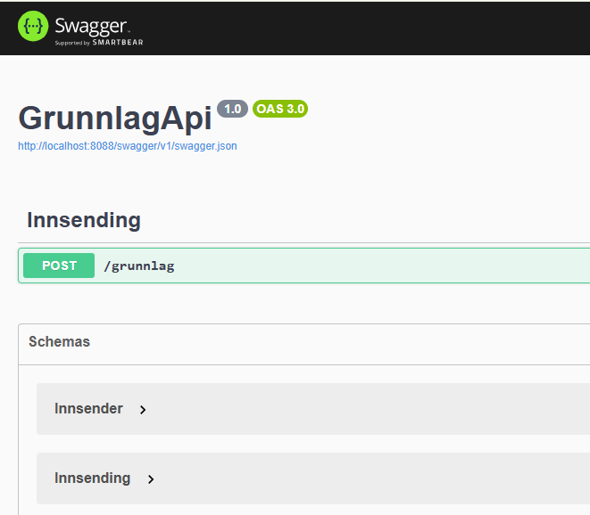

# 🚀 Brukerveiledning for GrunnlagApi i Visual Studio Code

Denne veiledningen viser hvordan du kommer i gang med utvikling og testing av **GrunnlagApi**-prosjektet i **Visual Studio Code**.

---

## ✅ Forutsetninger

Før du begynner, må følgende være installert:

- [.NET 8 SDK](https://dotnet.microsoft.com/en-us/download/dotnet/8.0)
- [Visual Studio Code](https://code.visualstudio.com/)
- C#-utvidelse for VS Code:  
  ➜ Installer "C# Dev Kit" eller "C# for Visual Studio Code" fra Microsoft

---

## 📦 Kom i gang

1. **Klon repoet:**

   ```bash
   git clone https://github.com/passelig/grunnlag.git
   cd Grunnlag
   ```

2. **Åpne prosjektet i VS Code:**

   ```bash
   code .
   ```

3. **Bekreft at alt er klart:**
   - Sørg for at mappene `GrunnlagApi` og `GrunnlagApi.Tests` ligger i samme mappe som `GrunnlagApi.sln`
   - VS Code vil foreslå å installere nødvendige avhengigheter første gang du åpner løsningen – godta dette.

---

## 🧪 Kjør enhetstester

Kjør følgende kommando for å sjekke at testene fungerer:

```bash
dotnet test
```

Du skal få en melding som viser at testene passerer ✅.

---

## 🐞 Kjør og debug API-et

Start API-et i "watch mode" med automatisk omstart når filer endres:

```bash
dotnet watch run --project GrunnlagApi
```

Dette starter webserveren, vanligvis på:

```
https://localhost:5001/grunnlag
```

---

## 🧪 Manuell testing med Swagger

Når API-et kjører, åpne nettleseren og gå til:

```
https://localhost:8088/swagger
```

Her kan du teste endepunktene direkte via Swagger UI.


---

## 🧼 Feilsøking

- Kjør `dotnet clean` og `dotnet build` ved behov
- Slett `bin/` og `obj/`-mapper manuelt hvis noe henger
- Sørg for at testprosjektet **ikke ligger inni** `GrunnlagApi`-mappen
